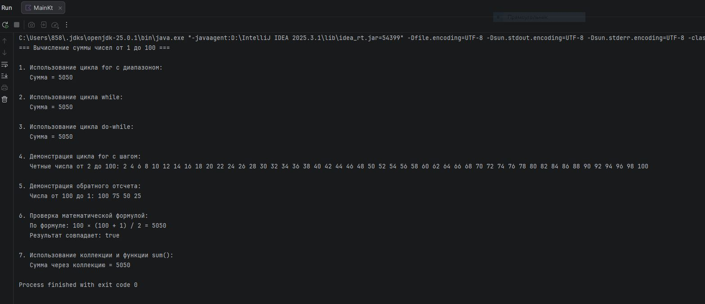

# Практическая работа 3. Циклы

## Вариант 3

### Задание
Найти сумму чисел от 1 до 100.
### Код программы
```kotlin
fun main() {
    println("=== Вычисление суммы чисел от 1 до 100 ===\n")
    
    // Способ 1: Цикл for с диапазоном
    println("1. Использование цикла for с диапазоном:")
    var sumFor = 0
    for (i in 1..100) {
        sumFor += i
    }
    println("   Сумма = $sumFor\n")
    
    // Способ 2: Цикл while
    println("2. Использование цикла while:")
    var sumWhile = 0
    var number = 1
    while (number <= 100) {
        sumWhile += number
        number++
    }
    println("   Сумма = $sumWhile\n")
    
    // Способ 3: Цикл do-while
    println("3. Использование цикла do-while:")
    var sumDoWhile = 0
    var num = 1
    do {
        sumDoWhile += num
        num++
    } while (num <= 100)
    println("   Сумма = $sumDoWhile\n")
    
    // Способ 4: Цикл for с шагом (демонстрация)
    println("4. Демонстрация цикла for с шагом:")
    print("   Четные числа от 2 до 100: ")
    for (i in 2..100 step 2) {
        print("$i ")
    }
    println("\n")
    
    // Способ 5: Цикл for в обратном порядке (демонстрация)
    println("5. Демонстрация обратного отсчета:")
    print("   Числа от 100 до 1: ")
    for (i in 100 downTo 1) {
        if (i % 25 == 0) print("$i ") // Показываем каждое 25-е число для краткости
    }
    println("\n")
    
    // Проверка математической формулой
    println("6. Проверка математической формулой:")
    val n = 100
    val formulaSum = n * (n + 1) / 2
    println("   По формуле: 100 × (100 + 1) / 2 = $formulaSum")
    println("   Результат совпадает: ${sumFor == formulaSum}")
    
    // Дополнительно: сумма с использованием коллекции
    println("\n7. Использование коллекции и функции sum():")
    val numbersList = (1..100).toList()
    val sumCollection = numbersList.sum()
    println("   Сумма через коллекцию = $sumCollection")
}
```
