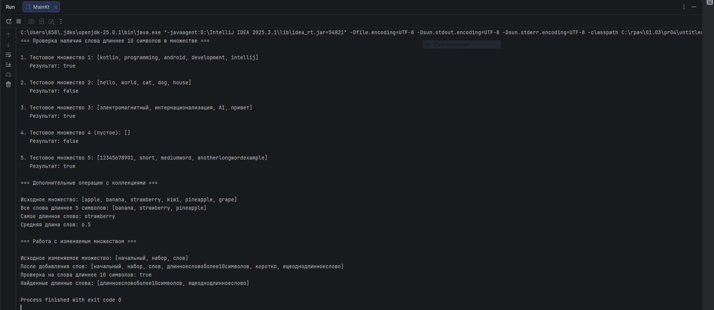

# Практическая работа 4. Работа с коллекциями в Kotlin

## Вариант 3

### Задание
Создайте множество строк. Напишите функцию, которая проверяет, есть ли в множестве слово длиннее 10 символов.

### Код программы
```kotlin
fun main() {
    println("=== Проверка наличия слова длиннее 10 символов в множестве ===\n")
    
    // Создание различных множеств для тестирования
    val testSet1 = setOf("kotlin", "programming", "android", "development", "intellij")
    val testSet2 = setOf("hello", "world", "cat", "dog", "house")
    val testSet3 = setOf("электромагнитный", "интернационализация", "AI", "привет")
    val testSet4 = setOf<String>() // Пустое множество
    val testSet5 = setOf("12345678901", "short", "mediumword", "anotherlongwordexample")
    
    println("1. Тестовое множество 1: $testSet1")
    println("   Результат: ${hasWordLongerThan10Chars(testSet1)}")
    
    println("\n2. Тестовое множество 2: $testSet2")
    println("   Результат: ${hasWordLongerThan10Chars(testSet2)}")
    
    println("\n3. Тестовое множество 3: $testSet3")
    println("   Результат: ${hasWordLongerThan10Chars(testSet3)}")
    
    println("\n4. Тестовое множество 4 (пустое): $testSet4")
    println("   Результат: ${hasWordLongerThan10Chars(testSet4)}")
    
    println("\n5. Тестовое множество 5: $testSet5")
    println("   Результат: ${hasWordLongerThan10Chars(testSet5)}")
    
    // Дополнительная демонстрация функций высшего порядка
    println("\n=== Дополнительные операции с коллекциями ===\n")
    
    val mixedSet = setOf("apple", "banana", "strawberry", "kiwi", "pineapple", "grape")
    
    println("Исходное множество: $mixedSet")
    println("Все слова длиннее 5 символов: ${findWordsLongerThan(mixedSet, 5)}")
    println("Самое длинное слово: ${findLongestWord(mixedSet)}")
    println("Средняя длина слов: ${calculateAverageLength(mixedSet)}")
    
    // Демонстрация изменяемого множества
    println("\n=== Работа с изменяемым множеством ===\n")
    
    val mutableWordSet = mutableSetOf("начальный", "набор", "слов")
    println("Исходное изменяемое множество: $mutableWordSet")
    
    mutableWordSet.add("длинноесловоболее10символов")
    mutableWordSet.add("коротко")
    mutableWordSet.add("ещеоднодлинноеслово")
    
    println("После добавления слов: $mutableWordSet")
    println("Проверка на слова длиннее 10 символов: ${hasWordLongerThan10Chars(mutableWordSet)}")
    println("Найденные длинные слова: ${findWordsLongerThan(mutableWordSet, 10)}")
}

/**
 * Функция проверяет, есть ли в множестве слово длиннее 10 символов
 * @param wordSet Множество строк для проверки
 * @return true, если найдено слово длиннее 10 символов, иначе false
 */
fun hasWordLongerThan10Chars(wordSet: Set<String>): Boolean {
    for (word in wordSet) {
        if (word.length > 10) {
            return true
        }
    }
    return false
}

/**
 * Альтернативная реализация с использованием функции высшего порядка any()
 */
fun hasWordLongerThan10CharsFunctional(wordSet: Set<String>): Boolean {
    return wordSet.any { it.length > 10 }
}

/**
 * Функция для поиска всех слов длиннее указанного количества символов
 * @param wordSet Множество строк для поиска
 * @param minLength Минимальная длина слова
 * @return Список слов, длина которых превышает minLength
 */
fun findWordsLongerThan(wordSet: Set<String>, minLength: Int): List<String> {
    return wordSet.filter { it.length > minLength }
}

/**
 * Функция для поиска самого длинного слова в множестве
 * @param wordSet Множество строк
 * @return Самое длинное слово или null, если множество пустое
 */
fun findLongestWord(wordSet: Set<String>): String? {
    return wordSet.maxByOrNull { it.length }
}

/**
 * Функция для вычисления средней длины слов в множестве
 * @param wordSet Множество строк
 * @return Средняя длина слов
 */
fun calculateAverageLength(wordSet: Set<String>): Double {
    if (wordSet.isEmpty()) return 0.0
    return wordSet.sumOf { it.length }.toDouble() / wordSet.size
}
```
