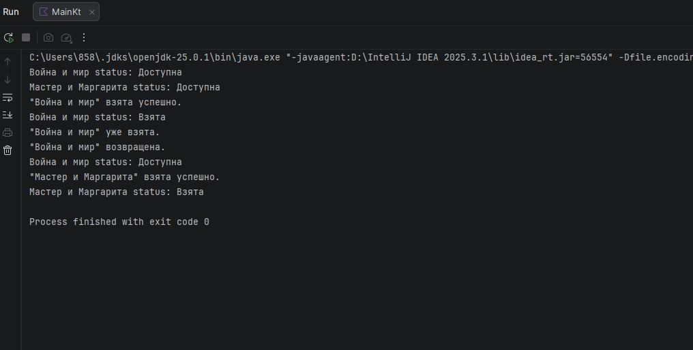

# Практическая работа 5. Классы и объекты
## Вариант 3

### Задание
 Создать класс "Книга" с информацией о книге и методами для работы с состоянием (взята/возвращена).

### Код программы
```kotlin
fun main() {
    // Создаем экземпляры книг
    val book1 = Book("Война и мир", "Лев Толстой", 1869)
    val book2 = Book("Мастер и Маргарита", "Михаил Булгаков", 1967)

    // Проверка статусов
    println("${book1.title} status: ${book1.getStatus()}")
    println("${book2.title} status: ${book2.getStatus()}")

    // Взятие книг
    book1.takeBook()
    println("${book1.title} status: ${book1.getStatus()}")

    // Попытка взять книгу, которая уже взята
    book1.takeBook()

    // Вернуть книгу
    book1.returnBook()
    println("${book1.title} status: ${book1.getStatus()}")

    // Взять вторую книгу
    book2.takeBook()
    println("${book2.title} status: ${book2.getStatus()}")
}// Класс Книга, описывающий свойства книги и методы для управления её состоянием
class Book(
    val title: String,           // Название книги
    val author: String,          // Автор
    val year: Int                // Год издания
) {
    private var isTaken = false // Состояние: взята или возвращена

    // Метод взять книгу
    fun takeBook() {
        if (!isTaken) {
            isTaken = true
            println("\"$title\" взята успешно.")
        } else {
            println("\"$title\" уже взята.")
        }
    }

    // Метод вернуть книгу
    fun returnBook() {
        if (isTaken) {
            isTaken = false
            println("\"$title\" возвращена.")
        } else {
            println("\"$title\" не была взята.")
        }
    }

    // Метод для проверки статуса
    fun getStatus(): String {
        return if (isTaken) "Взята" else "Доступна"
    }
}
}
```
